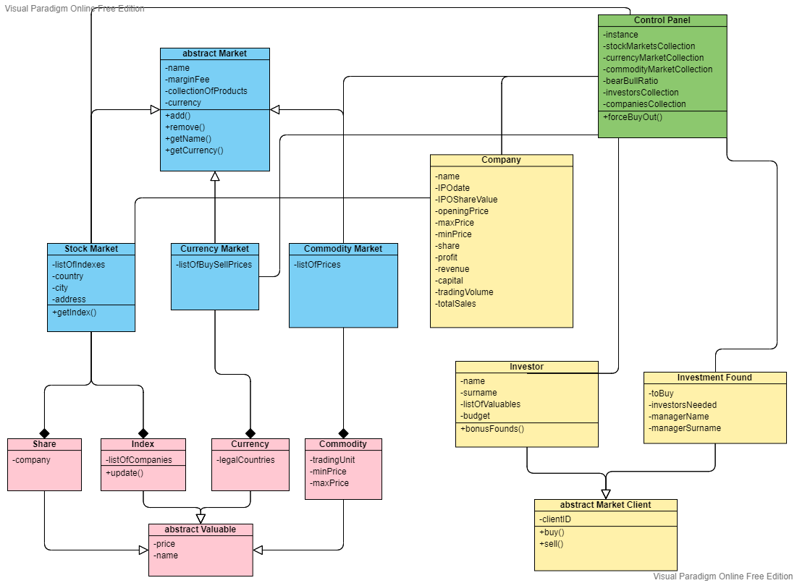
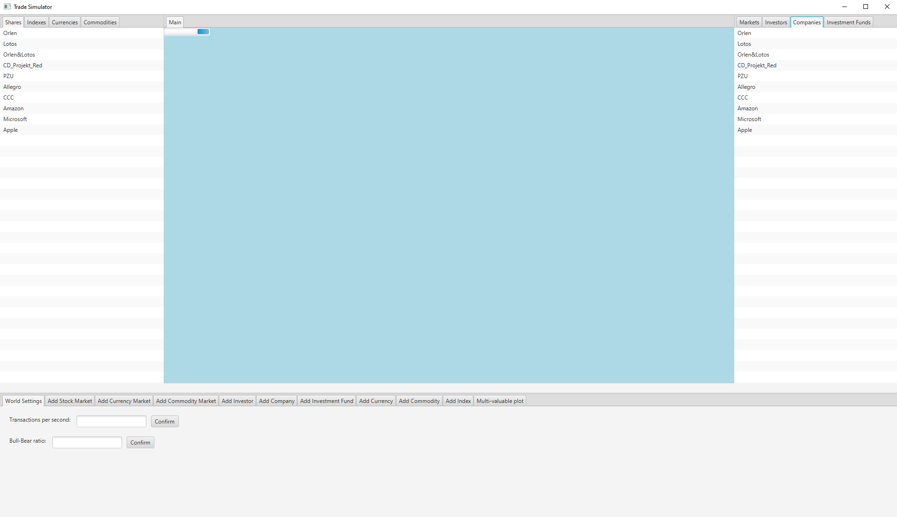

# TradeSimulator
### Jakub Cichy 148281
My first application in java made as a project for Object-oriented programing at university. The task was to develop 
simulation of multiple stock, commodity and currency markets and investors, funds and companies which buys and sells them.
Detailed information about project requirements can be read here: 
[requirements](src/main/resources/OOP%20Java%20Project%202021.pdf)
## UML class diagram
First step was creating a UML class diagram.

## Tests
After reading "Clean Code" by uncle Bob I wanted to give test driven development a try. At the beginning I read some 
tutorials and added tests to my application. Later, when I could check If everything works correctly on GUI I stopped 
adding new tests but kept old one updated and checked if they pass. Overall it for sure wasn't perfect TDD approach, 
but I'm quite proud of it.
## Input
Basic input for simulator is taken from BasicInput.txt. It's a special file where we got written all parameters needed to 
make instances (markets, market clients and valuables) in special order. Application automatically fill world with those 
instances at the beginning.
## GUI
For gui I used javafx. It worked quite good, after learning about observable lists everything works as I would like to, 
but I definitely don't like its documentation.

## Concurrency
The hardest part was to make all investors, companies and funds separate threads. When we learned about concurrency in 
java everything looked so easy, but all this information doesn't apply to javafx. Instead of normal threads I had to use 
tasks which looks similar. Unfortunately there are some differences that made process very hard and still I'm not sure 
If I understand Tasks correctly.
